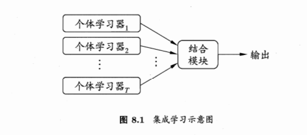
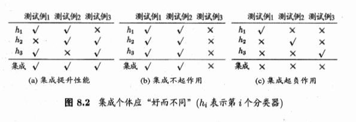
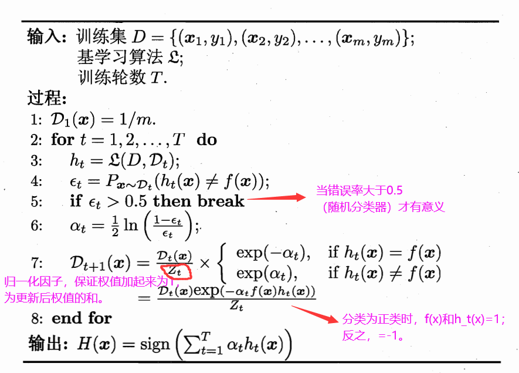
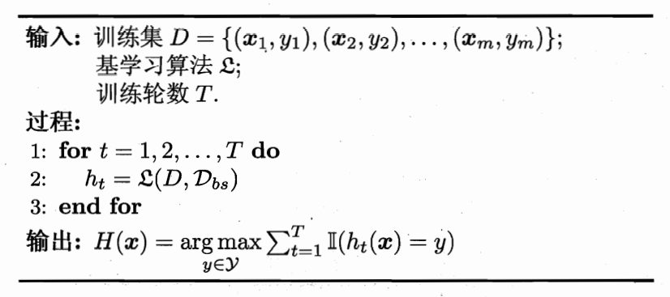

# 集成学习 ensemble learning

## 8.1 个体与集成

### **“同质”集成（homogeneous）**
集成中只包含同种类型的个体学习器
其中的个体学习器称为“基学习器”，相应的学习算法称为基学习算法
### **“异质”集成（heterogenous）**
集成中包含不同类型的个体学习器，例如同时包含决策树和神经网络等
其中的学习器称为“组件学习器”或者直接称为个体学习器
### **用途**
通过将多个学习器结合，可获得比单一学习器卓越优越的泛化性能。这针对“弱学习器”尤为明显。  
 
为了提高性能，学习器间应该具有差异，要有多样性

 
**(P172)** 由Hoeffding不等式可知，集成的错误率为
$$\begin{aligned}
P(H(x)\neq f(x))&=\sum_{k=0}^{\lfloor T/2\rfloor}\binom{T}{k}(1-\epsilon)^k\epsilon^{T-k}\\
&\leq \exp(-\frac{1}{2}T(1-2\epsilon)^2)
\end{aligned}$$
可知随着集成中个体分类器数目T的增大，集成的错误率将指数级下降，最后趋于0 
根据个体学习器的生成方式，大致分为两类： 
1.个体学习器之间存在强依赖关系，必须串行生成的序列化方法 
2.个体学习器之间不存在强依赖关系，可同时生成的并行化方法 
## 8.2 Boosting(AdaBoost)
由基学习器的线性组合
$$H(x)=\sum_{t=1}^T\alpha_th_t(x)$$
来最小化指数损失函数( $\mathcal{D}$ 为样本权值分布)
$$\ell_{exp}(H\mid \mathcal {D})=\mathbb{E}_{x\sim\mathcal{D}}[e^{-f(x)H(x)}]$$
### 算法如下:  推导详见 **P174~176**  

### **Notes：** 
1. 上述方法采用“重赋权法”，而对于不能接受带权样本的学习算法，可以通过“重采样法”来处理，即根据样本权值分布对训练集进行重新采样，再用这个重新采样的样本对基学习器进行训练。 
这种做法也可以使得当$\epsilon>0.5$ 时，可以重新再来一次，而不是直接停止。
2. 上述方法用于二元分类，如果想用于处理多分类或回归任务需要进行修改

## 8.3.1 Bagging
### **自助采样法**
  1. 给定训练集大小为m
  2. 随机取出一个放入采样集，再放回
  3. 经过m次随机采样后，获得一个m样本的采样集  
   （约有63.2%的样本出现在采样集中）
  4. 采样出T个m大小的采样集，然后基于每个采样集训练出一个基学习器并进行结合
### **算法**

### **Notes：**
1. 通常对分类任务使用简单投票法，对回归任务使用简单平均法
2. 剩下的约36.8%的样本可用于验证集对泛化性能进行“包外估计”
3. 包外样本也可以用来辅助剪枝，辅助early stopping等等
 
## 8.3.2 随机森林（Random Forest，简称RF）
### **Bagging的扩展变体**
基学习器采用**决策树**，进一步在决策树的训练过程中引入了随机属性选择。  
**具体做法为：**  
从该结点的属性集合（共d个）中随机选择一个包含k个属性的子集，  
然后再从这个子集中选择一个最优属性用于划分。  
若k=d，则与传统决策树相同；  
若k=1，则是随机选择一个属性;  
**一般推荐值$k=log_2d$** 
## 8.4 结合策略
### 学习器结合的三个好处
1. 减少泛化性能不佳的风险
2. 降低陷入局部极小点的风险
3. 相应的假设空间扩大，有可能学得更好的近似

### 8.4.1 平均法
* 简单平均
$$H(x)=\frac{1}{T}\sum_{i=1}^{T}h_i(x)$$
* 加权平均
$$H(x)=\sum_{i=1}^{T}w_ih_i(x)$$
$w_i$为个体学习器$h_i$的权重，一般 $w_i\geq 0, \sum_{i-1}^{T}w_i=1$  
一般而言，在**个体学习器性能差距较大时**宜使用加权平均，**性能相近时**宜使用简单平均。  
### 8.4.2 投票法
* 绝对多数投票法
* 相对多数投票法
* 加权投票法